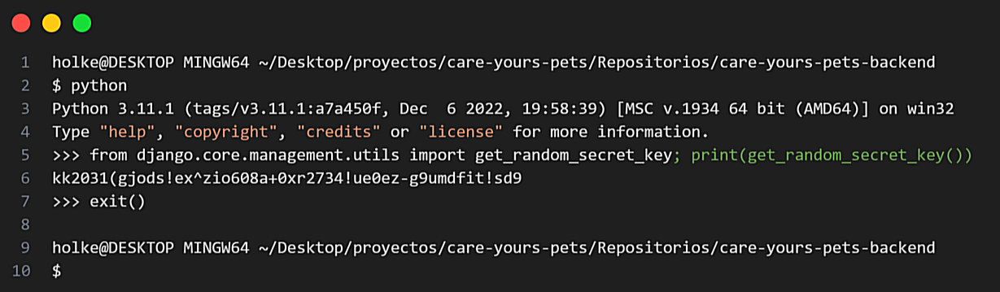
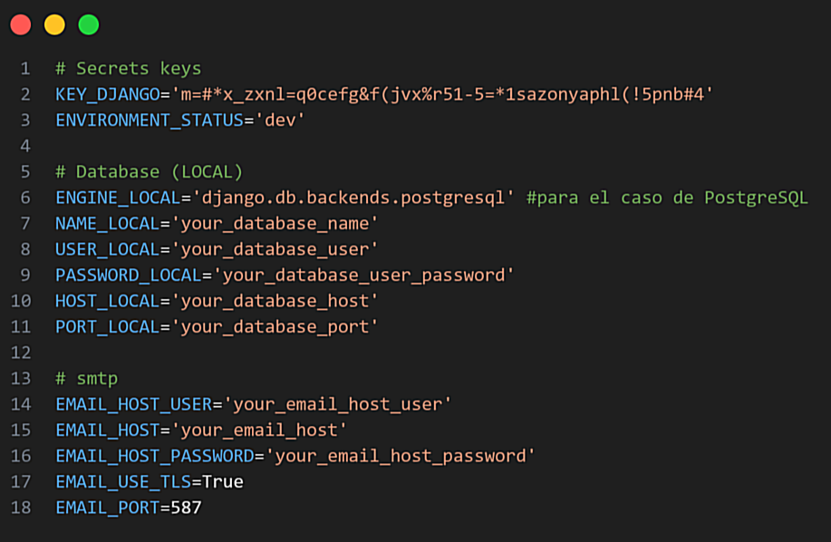
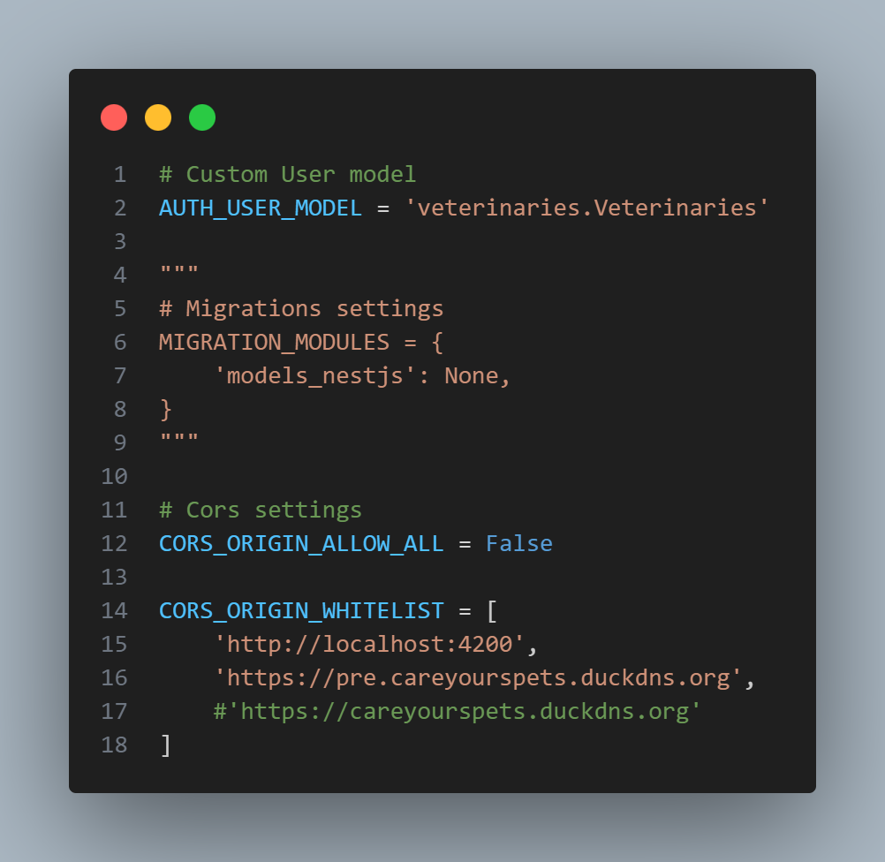

# Repositorio backend CareYoursPets (5ta Devathon-equipo 4)

## 1. Descripción

Este repositorio contiene el código fuente del backend de la plataforma CareYourPets. El backend se desarrolló utilizando dos marcos de trabajo potentes: NestJS y Django Rest Framework.

NestJS es un framework para construir aplicaciones de servidor eficientes y escalables en [Node.js](https://nodejs.org/). Permite a los desarrolladores aprovechar el desarrollo de JavaScript del lado del servidor con una sintaxis similar a la de Angular.

[Django Rest](https://www.django-rest-framework.org/) es un marco de trabajo de alto nivel en [Python](https://www.python.org/) que permite construir poderosas API web de manera rápida y fácil. Fomenta un diseño limpio y pragmático en el desarrollo.

La combinación de estas tecnologías nos permite crear un backend fiable, rápido y seguro para CareYourPets.


### 1.1 Características del proyecto

- Usuario
    - Autenticación
    - CRUD
    - Restablecimiento de contraseña
- Mascotas
    - CRUD
- Veterinarias
    - Autenticación
    - CRUD
    - Restablecimiento de contraseña


## 2. Instalación en local

Primero debes clonar este repositorio utilizando el siguiente comando en tu consola.

```bash
  git clone https://github.com/Care-Yours-Pets/CareYoursPets-backend.git
```


### 2.1 Inicialización del servidor de desarrollo NestJS

Estos son los pasos para la inicialización del servidor NestJS en local.


- **Paso 1 (requerimientos):** asegúrese de que Node.js (versión >= 16) esté instalado en su sistema operativo.

- **Paso 2 (configurar variables de entorno):** Crear un archivo con el nombre ".env" dentro de la carpeta "users". Dentro de este archivo definimos las variables que vamos a usar. 

    ```bash
    JWT_REFRESH_SECRET=refresh_secret
    JWT_REFRESH_SECRET_EXPIRY=1d
    JWT_ACCESS_SECRET=access_secret
    JWT_ACCESS_SECRET_EXPIRY=120m
    DATABASE_HOST=your-host
    DATABASE_USERNAME=username
    DATABASE_PASSWORD=password
    DATABASE_PORT=port
    DATABASE_NAME=name
    ```

    Para generar la JWT_REFRESH_SECRET y JWT_ACCESS_SECRET se usa el siguiente comando.

    ```bash
    node -e "console.log(require('crypto').randomBytes(256).toString('base64'));"
    ```

- **Paso 3 (instalar dependencias):** Usaremos NPM como gestor de libreria y vamos a instalar las dependencias necesarias para el correcto funcionamiento del framework:

    - bcrypt
    - swagger
    - class-validator
    - class-transformer
    - typeorm
    - jwt
    - passport y passport-jwt
    - config
    - mapped-types

    Luego instalamos las dependencias del package.json con el siguiente comando.

    ```bash
    npm install
    ```

  Otras dependencias que se requieren es EsLint que viene pre-instalado en el proyecto.


- **Paso 4 (iniciar el servidor):** Iremos a la carpeta del proyecto.

    ```bash
    cd users
    ```

  Por ultimo iniciamo el servidor.

    ```bash
    #Ejecutar la aplicación
    npm run start

    #Para ver los cambios en tus archivos
    npm run start:dev
    ```

### 2.2 Inicialización del servidor de desarrollo DRF

Estos son los pasos para la inicialización del servidor Django Rest Framework en local.

- **Paso 1 (requerimientos):** asegúrese de tener instalada una version de Python superior a la 3.10 en su sistema operativo.

- **Paso 2 (instalar dependencias):** instala las tecnologías y paquetes que usa el proyecto. Asegurate de estar dentro de la carpeta backend_drf/src.

    ```bash
    pip install -r "requirements.txt"
    ```

- **Paso 3 (configurar variables de entorno):** se debe crear un archivo con el nombre ".env" dentro de la carpeta "veterinary". Dentro de este archivo se definiran todas las variables de entorno que necesita el backend de Django rest para funcionar correctamente.

    **Variable KEY_DJANGO:** el valor de esta variable lo obtendremos escribiendo en orden los siguientes comandos en tu consola.

    ```bash
    #Primer comando
    python

    #Segundo comando
    from django.core.management.utils import get_random_secret_key; print(get_random_secret_key())
    ```
    El ultimo comando retorna el valor de la "KEY_DJANGO" que deberas copiar en el archivo ".env".

    

    Luego en el archivo ".env" agregas el valor de la variable "KEY_DJANGO" junto con las demas variables.

    

- **Paso 4 (realizar migraciones):** si deseas iniciar solamente el servidor de desarrollo DRF, primero deberas comentar la variable "MIGRATION_MODULES" en el fichero de la siguiente ruta y luego aplicarlas migraciones.

    ```bash
    care-yours-pets-backend/backend_drf/src/backend_settings/settings/base.py
    ```

    

    Si deseas iniciar los dos servidores de desarollo (DRF y NestJS) al mismo tiempo solamente aplicamos las migraciones con el siguiente comando.

    ```bash
    python manage.py migrate
    ```

- **Paso 5 (Iniciar el servidor):** para iniciar el servidor de manera local ejecuta el siguiente comando.

    ```bash
    python manage.py runserver
    ```

### 2.3 Iniciar test
Para correr las pruebas unitarias del "backend_drf" ejecuta el siguiente comando.

```bash
python manage.py test
```


## 3. Integrantes del repositorio
- [Carlos Vega](https://github.com/temeriamos)
- [Carlos Andres Aguirre](https://github.com/The-Asintota)
- [Diego Pérez](https://github.com/sistemasitpro)